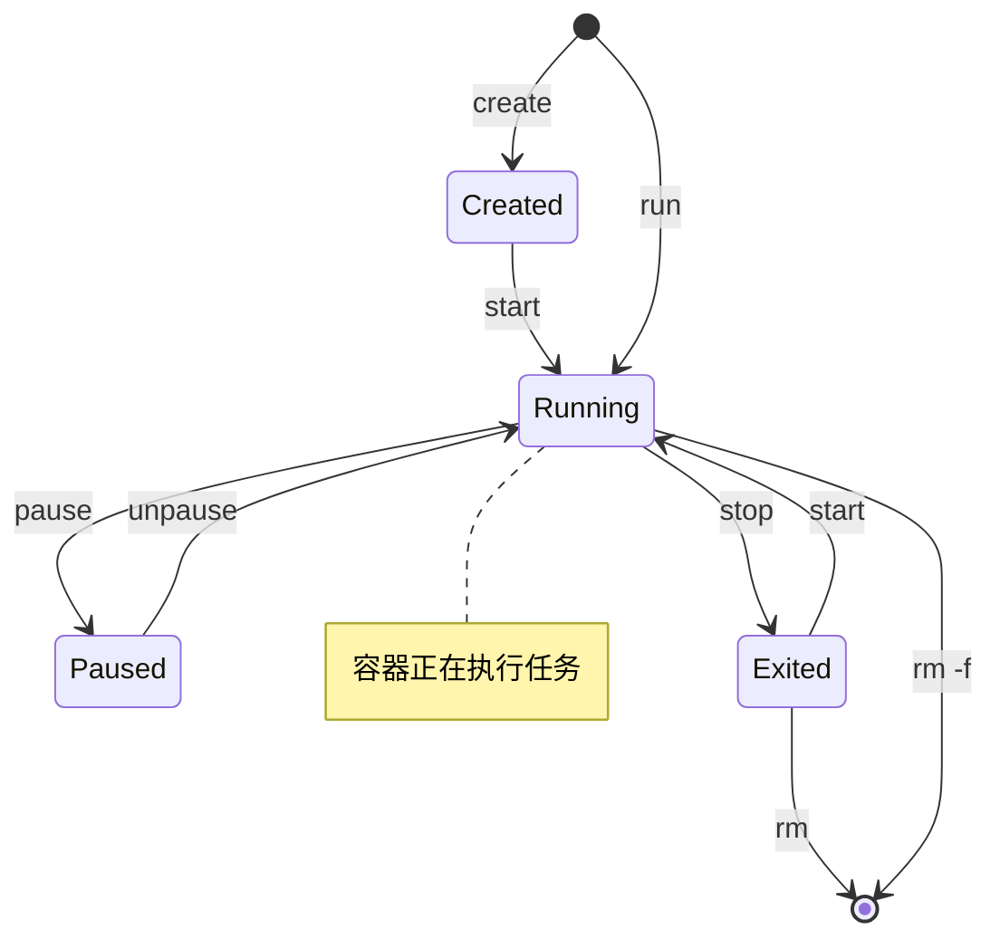

# Docker 教程 - 02. 常用命令速查

> **适合人群**：初学者
> **前置知识**：已安装 Docker
> **预计时间**：20 分钟

## 🔄 容器生命周期

理解容器的状态流转对于掌握命令至关重要。



## 📦 镜像管理 (Images)

| 命令 | 说明 | 示例 |
| :--- | :--- | :--- |
| `docker pull` | 从仓库拉取镜像 | `docker pull nginx:latest` |
| `docker images` | 列出本地镜像 | `docker images` |
| `docker rmi` | 删除本地镜像 | `docker rmi nginx` |
| `docker search` | 搜索镜像 | `docker search mysql` |
| `docker build` | 从 Dockerfile 构建 | `docker build -t myapp .` |

## 🏃 容器管理 (Containers)

### 启动与停止

*   **运行容器**：
    ```bash
    # -d: 后台运行
    # -p: 端口映射 (宿主机:容器)
    # --name: 指定名称
    docker run -d -p 8080:80 --name my-nginx nginx
    ```

*   **查看运行中的容器**：
    ```bash
    docker ps
    # 查看所有容器（包括已停止的）
    docker ps -a
    ```

*   **停止与启动**：
    ```bash
    docker stop my-nginx
    docker start my-nginx
    docker restart my-nginx
    ```

*   **删除容器**：
    ```bash
    docker rm my-nginx
    # 强制删除运行中的容器
    docker rm -f my-nginx
    ```

### 调试与交互

*   **查看日志**：
    ```bash
    # -f: 实时跟踪日志
    docker logs -f my-nginx
    ```

*   **进入容器内部**：
    ```bash
    # -it: 交互式终端
    # /bin/bash: 要执行的命令（sh 或 bash）
    docker exec -it my-nginx /bin/bash
    ```
    *退出容器内部只需输入 `exit`。*

## 🧹 清理命令

当系统空间不足时，可以使用 prune 命令清理未使用的资源。

```bash
# 清理所有停止的容器
docker container prune

# 清理所有未被使用的镜像（悬空镜像）
docker image prune

# 清理所有未使用的镜像、容器、网络（慎用！）
docker system prune
```

## 📚 总结

*   `docker run` 是最核心的命令，集成了 pull, create, start。
*   `docker exec -it` 是调试容器的神器。
*   `docker logs -f` 类似于 Linux 的 `tail -f`。

下一章，我们将学习如何通过 **Dockerfile** 构建自己的镜像。
