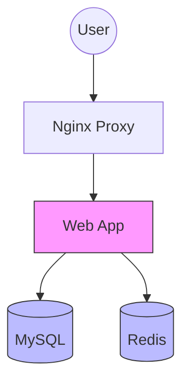

# Docker 教程 - 04. Docker Compose 编排

> **适合人群**：开发者
> **前置知识**：Dockerfile 基础
> **预计时间**：15 分钟

## 🎼 什么是 Docker Compose？

在实际项目中，我们往往不仅仅运行一个容器。比如一个 Web 应用可能需要：
*   Python 后端容器
*   MySQL 数据库容器
*   Redis 缓存容器

使用 `docker run` 逐个启动非常麻烦且容易出错。**Docker Compose** 允许你用一个 `docker-compose.yml` 文件定义整个服务栈，并一键启动。

### 服务依赖图



## 📝 编写 docker-compose.yml

下面是一个典型的 FastAPI + Redis 示例：

```yaml
version: '3.8'  # Compose 文件版本

services:
  # 服务 1: Web 应用
  web:
    build: .  # 使用当前目录的 Dockerfile 构建
    ports:
      - "8000:8000"
    environment:
      - REDIS_HOST=redis
    depends_on:
      - redis  # 等待 redis 服务启动
    volumes:
      - .:/app  # 挂载代码，实现开发时热重载

  # 服务 2: Redis 数据库
  redis:
    image: "redis:alpine"
    ports:
      - "6379:6379"
```

### 关键配置详解

*   **`services`**：定义应用中的各个服务。
*   **`build`**：指定构建镜像的上下文。
*   **`image`**：直接使用现有的镜像。
*   **`ports`**：端口映射 `HOST:CONTAINER`。
*   **`depends_on`**：控制启动顺序（注意：它只等待容器启动，不等待应用就绪）。
*   **`environment`**：注入环境变量。
*   **`volumes`**：数据卷挂载。在此例中，我们将当前代码目录挂载到容器内，这样修改代码后无需重建镜像即可生效（配合开发服务器的热重载）。
*   **网络**：Compose 会自动创建一个默认网络，服务之间可以通过服务名（如 `redis`）直接互通。

## 🎮 常用命令

*   **启动所有服务**：
    ```bash
    # -d: 后台运行
    docker-compose up -d
    ```

*   **查看服务日志**：
    ```bash
    docker-compose logs -f
    ```

*   **停止并移除服务**：
    ```bash
    docker-compose down
    ```

*   **重新构建**：
    ```bash
    # 当 Dockerfile 发生变化时使用
    docker-compose up -d --build
    ```

*   **查看服务状态**：
    ```bash
    docker-compose ps
    ```

## 📚 总结

*   Docker Compose 是管理多容器应用的神器。
*   使用 YAML 文件描述基础设施。
*   `docker-compose up -d` 一键拉起整个环境。
*   服务之间可以通过服务名进行 DNS 解析。

下一章，我们将结合 FastAPI 进行一次完整的**应用容器化实战**。
