# Docker 教程 - 05. 实战：Python 应用容器化

> **适合人群**：Python 开发者
> **前置知识**：Dockerfile, FastAPI
> **预计时间**：25 分钟

## 🎯 实战目标

我们将构建一个基于 **FastAPI** 的高性能镜像，并使用 **UV** 包管理器来加速构建过程。

### 构建流程

```mermaid
flowchart LR
    Code[源代码] -->|UV Sync| Venv[虚拟环境]
    Venv -->|Copy| Stage1[构建阶段]
    Stage1 -->|Copy .venv| Stage2[运行阶段]
    Stage2 --> Image[最终镜像]
    
    style Image fill:#8bc34a,stroke:#333
```



## 📄 项目准备

假设文件结构如下：
```
my-app/
├── main.py
├── pyproject.toml
├── uv.lock
└── Dockerfile
```

`pyproject.toml` 示例：
```toml
[project]
name = "fastapi-docker"
version = "0.1.0"
requires-python = ">=3.10"
dependencies = ["fastapi", "uvicorn[standard]"]
```

## 🐳 编写优化的 Dockerfile

我们将使用 **多阶段构建 (Multi-stage builds)** 来减小最终镜像体积。

```dockerfile
# ==========================================
# 第一阶段：构建器 (Builder)
# ==========================================
FROM python:3.10-slim as builder

# 安装 UV
COPY --from=ghcr.io/astral-sh/uv:latest /uv /bin/uv

# 设置工作目录
WORKDIR /app

# 配置 UV 使用清华源 (加速下载)
ENV UV_INDEX_URL=https://pypi.tuna.tsinghua.edu.cn/simple

# 复制依赖文件
COPY pyproject.toml uv.lock ./

# 安装依赖到系统路径 (不创建 venv，简化路径)
# --system: 安装到系统 python 环境
# --deploy: 严格检查 lock 文件
RUN uv pip install --system --deploy -r pyproject.toml
# 或者如果使用 uv sync:
# RUN uv sync --frozen --no-install-project

# ==========================================
# 第二阶段：运行器 (Runner)
# ==========================================
FROM python:3.10-slim

WORKDIR /app

# 从构建阶段复制安装好的库
# 注意：直接复制 site-packages 可能比较复杂，
# 这里我们简化处理：直接在最终镜像用 UV 安装（利用缓存）
# 或者更标准的多阶段是把 venv 复制过去。

# 让我们用最稳健的 UV 推荐方式：
COPY --from=ghcr.io/astral-sh/uv:latest /uv /bin/uv
ENV UV_INDEX_URL=https://pypi.tuna.tsinghua.edu.cn/simple

COPY pyproject.toml uv.lock ./

# 使用 --system 安装，不包含 dev 依赖
RUN uv pip install --system --deploy -r pyproject.toml

# 复制业务代码
COPY . .

# 暴露端口
EXPOSE 8000

# 启动命令
CMD ["uvicorn", "main:app", "--host", "0.0.0.0", "--port", "8000"]
```

### 💡 更极致的优化：Distroless

如果你想要更小的镜像，可以使用 Google 的 distroless 镜像作为基础，但那不利于调试。对于大多数 Python 应用，`python:3.10-slim` 已经是体积和易用性的最佳平衡点。

## 🏃‍♂️ 构建与运行

```bash
# 1. 构建镜像
docker build -t fastapi-app:latest .

# 2. 运行容器
docker run -d -p 8000:8000 --name my-app fastapi-app:latest

# 3. 测试
curl http://localhost:8000
```

## 📦 关于 UV 的缓存

在 CI/CD 环境中，为了让 UV 充分利用缓存，你可能需要挂载缓存卷。但在 Docker 构建中，Docker 的层缓存机制（Layer Caching）通常已经足够高效：只要 `uv.lock` 没变，`RUN uv pip install ...`这一层就会直接使用缓存。

## 📚 总结

*   使用 `slim` 镜像作为基础。
*   利用 Docker 分层机制：先复制描述文件安装依赖，再复制源代码。
*   在 Dockerfile 中配置 `ENV UV_INDEX_URL` 使用国内源。
*   多阶段构建可以进一步分离构建环境和运行环境。

下一章，我们将深入了解 **Docker 网络与存储**。
