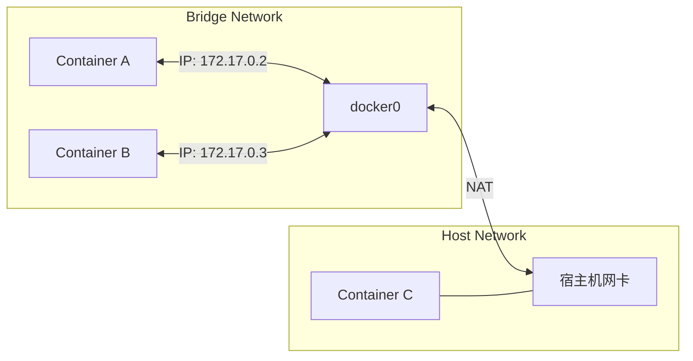

# Docker 教程 - 06. 网络与存储

> **适合人群**：进阶开发者
> **前置知识**：Docker 基础
> **预计时间**：20 分钟

## 💾 数据持久化 (Storage)

容器的一个核心特性是**临时性**：当容器删除时，里面的文件也会消失。如果你运行数据库，这显然是不可接受的。我们需要将数据**挂载**到宿主机。

### 挂载类型对比

```mermaid
graph TD
    Host[宿主机文件系统]
    Container[容器文件系统]
    
    subgraph Bind Mount
    PathA[宿主机任意路径<br>/home/user/code] <--> PathB[容器路径<br>/app]
    end
    
    subgraph Docker Volume
    Vol[Docker 管理区域<br>/var/lib/docker/volumes/...] <--> PathC[容器路径<br>/var/lib/mysql]
    end
    
    Host --> Bind Mount
    Host --> Docker Volume
    Bind Mount --> Container
    Docker Volume --> Container
```

1.  **Bind Mount (绑定挂载)**：
    *   直接映射宿主机的指定目录。
    *   **场景**：开发环境代码热重载、挂载配置文件。
    *   **命令**：`-v /home/user/code:/app`

2.  **Volume (数据卷)**：
    *   由 Docker 管理，存储在宿主机特定区域。
    *   **场景**：数据库数据、跨容器共享数据、生产环境。
    *   **命令**：`-v my-db-data:/var/lib/mysql`

### 示例：运行 MySQL 并持久化

```bash
# 1. 创建一个 Volume
docker volume create mysql-data

# 2. 运行 MySQL 挂载该 Volume
docker run -d \
  --name mysql \
  -e MYSQL_ROOT_PASSWORD=secret \
  -v mysql-data:/var/lib/mysql \
  mysql:8.0
```

即使你删除了这个容器 (`docker rm -f mysql`)，`mysql-data` 卷里的数据依然存在。下次再启动挂载它，数据就回来了。

## 🌐 Docker 网络 (Network)

容器之间如何通信？Docker 提供了多种网络模式。



1.  **Bridge (默认)**：
    *   容器有独立的 IP 段（如 172.17.0.x）。
    *   通过 NAT 访问外网。
    *   端口需要映射 (`-p`) 才能被外部访问。

2.  **Host**：
    *   容器共享宿主机的网络栈。
    *   没有独立 IP，直接使用宿主机 IP 和端口。
    *   性能最好，但端口容易冲突。
    *   **命令**：`--network host`

3.  **None**：
    *   只有 lo 网卡，无法联网。

### 自定义网络 (推荐)

使用 Docker Compose 或 `docker network create` 创建的网络，支持通过**容器名**进行 DNS 解析。

```bash
# 1. 创建网络
docker network create my-net

# 2. 启动容器加入网络
docker run -d --name app1 --network my-net my-app
docker run -d --name app2 --network my-net my-app

# 3. 在 app1 中 ping app2
# 直接使用容器名即可，不需要知道 IP
docker exec app1 ping app2
```

## 📚 总结

*   **Volume** 是生产环境存储数据的首选。
*   **Bind Mount** 适合开发环境挂载代码。
*   默认使用 **Bridge** 网络。
*   创建自定义网络可以实现容器间的 **DNS 解析**，无需硬编码 IP。

🎉 **恭喜！** 你已经掌握了 Docker 的核心知识。结合前面的 FastAPI 教程，你现在可以构建、打包并运行完整的现代化 Web 应用了。
