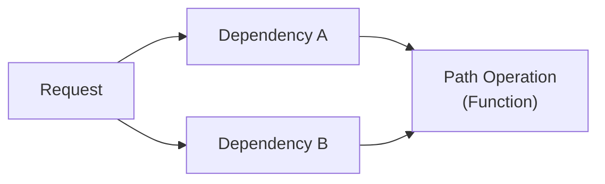

# FastAPI 教程 - 09. 依赖注入入门

> **适合人群**：进阶开发者
> **前置知识**：Python 函数
> **预计时间**：20 分钟

## 🧩 什么是依赖注入？

**依赖注入 (Dependency Injection, DI)** 听起来很深奥，但在 FastAPI 中它非常简单且实用。

它主要用于：
*   共享逻辑（代码复用）。
*   共享数据库连接。
*   实现安全认证、权限验证。
*   减少代码重复。

简而言之，就是**你需要什么，FastAPI 就给你送过来**。

### 依赖解析过程



## 🛠️ 创建一个依赖项

依赖项就是一个简单的 Python 函数（可以是异步 `async` 也可以是同步）。

假设我们有一个分页的逻辑，在很多接口都要用到 `skip` 和 `limit`。

```python
from fastapi import FastAPI, Depends

app = FastAPI()

# 1. 定义依赖函数
async def common_parameters(q: str | None = None, skip: int = 0, limit: int = 100):
    return {"q": q, "skip": skip, "limit": limit}

# 2. 在路径操作中使用 Depends
@app.get("/items/")
async def read_items(commons: dict = Depends(common_parameters)):
    return commons

@app.get("/users/")
async def read_users(commons: dict = Depends(common_parameters)):
    return commons
```

### 代码解析

1.  **定义依赖**：`common_parameters` 接收 `q`, `skip`, `limit` 参数。这和普通的路径操作函数一模一样。
2.  **使用依赖**：在 `read_items` 中，我们将参数 `commons` 声明为依赖于 `common_parameters`。
3.  **执行流程**：
    *   当请求 `/items/` 时，FastAPI 发现需要 `commons`。
    *   它会先调用 `common_parameters` 函数。
    *   解析 URL 中的 `q`, `skip`, `limit` 传给这个函数。
    *   获取函数返回值，赋值给 `commons`。
    *   最后执行 `read_items` 逻辑。

## 📦 嵌套依赖

依赖项可以依赖于其他依赖项！

```python
def query_extractor(q: str | None = None):
    return q

def query_or_cookie_extractor(
    q: str = Depends(query_extractor), 
    last_query: str | None = None
):
    if not q:
        return last_query
    return q

@app.get("/items/")
async def read_query(query_str: str = Depends(query_or_cookie_extractor)):
    return {"query_string": query_str}
```

FastAPI 会自动构建依赖图（Dependency Graph）并按正确顺序执行。

## 📚 总结

*   依赖注入用于代码复用和逻辑解耦。
*   依赖项就是普通函数。
*   使用 `Depends(func)` 将依赖注入到路径操作中。
*   FastAPI 自动处理参数获取和依赖执行顺序。

下一章，我们将学习如何使用**类**作为依赖项，这在处理复杂逻辑时非常有用。
