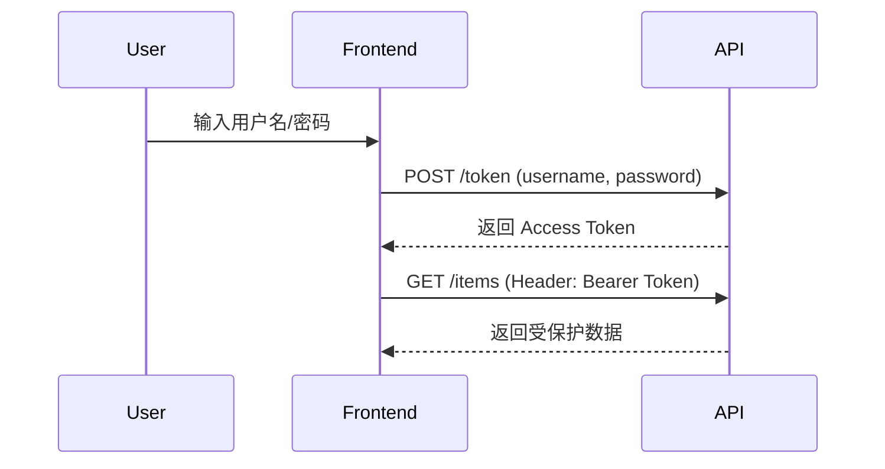

# FastAPI 教程 - 11. 安全基础

> **适合人群**：后端开发者
> **前置知识**：HTTP Header, 依赖注入
> **预计时间**：20 分钟

## 🛡️ FastAPI 的安全工具

FastAPI 提供了 `fastapi.security` 模块，封装了多种安全机制（OAuth2, API Key, HTTP Basic 等）。它们本质上都是**依赖项**。

## 🔑 OAuth2 密码模式

我们将实现 **OAuth2 Password Flow**。这是最常见的登录方式：前端发送用户名和密码，后端验证后返回一个 Token（通常是 Bearer Token）。前端之后在请求头中携带这个 Token。

### 认证流程图



### 1. 设置 OAuth2Scheme

```python
from fastapi import FastAPI, Depends
from fastapi.security import OAuth2PasswordBearer
from typing import Annotated

app = FastAPI()

# 告诉 FastAPI，Token 获取地址是 /token
oauth2_scheme = OAuth2PasswordBearer(tokenUrl="token")

@app.get("/items/")
async def read_items(token: Annotated[str, Depends(oauth2_scheme)]):
    return {"token": token}
```

### 代码解析

1.  `OAuth2PasswordBearer` 是一个类，它也是一个依赖项。
2.  `tokenUrl="token"`：这是告诉 Swagger UI，为了获取 Token，应该向哪个 URL 发送用户名和密码（我们稍后会实现这个 `/token` 接口）。
3.  **依赖注入**：当请求 `/items/` 时：
    *   FastAPI 会检查请求头 `Authorization: Bearer <token>`。
    *   如果没有 Header 或格式不对，直接返回 401 Unauthorized。
    *   如果存在，提取 Token 字符串并赋值给 `token` 参数。

## 🎩 Swagger UI 的魔法

现在运行代码并访问 `/docs`。

你会发现右上角多了一个绿色的 **Authorize** 按钮！

1.  点击它，会弹出一个登录框（用户名/密码）。
2.  虽然我们还没实现 `/token` 逻辑，但这展示了 FastAPI 如何自动集成 OAuth2 标准。
3.  即使你现在输入并点击 Authorize，它会报错，因为 `/token` 路由还不存在。

## 📚 总结

*   FastAPI 的安全机制基于依赖注入。
*   `OAuth2PasswordBearer` 用于从请求头提取 Token。
*   FastAPI 自动集成 Swagger UI 的登录功能。

下一章，我们将实现真正的 **JWT Token 生成与验证**，完成整个闭环。
