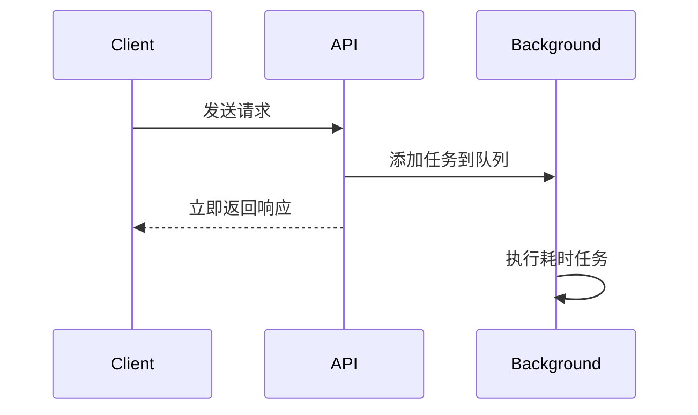

# FastAPI 教程 - 16. 后台任务

> **适合人群**：后端开发者
> **前置知识**：Python 异步基础
> **预计时间**：10 分钟

## 🐢 为什么需要后台任务？

有些操作比较耗时，但客户端不需要等待它们完成。例如：
*   用户注册后发送欢迎邮件。
*   接收文件上传后进行压缩处理。
*   记录详细的操作日志。

如果你在请求处理函数中直接执行这些操作，用户就必须等待所有操作完成才能收到响应。

### 执行时序图



## 🐇 使用 BackgroundTasks

FastAPI 提供了 `BackgroundTasks` 类，可以让你安排任务在**返回响应之后**执行。

```python
from fastapi import BackgroundTasks, FastAPI

app = FastAPI()

# 定义一个耗时任务
def write_notification(email: str, message: str):
    with open("log.txt", "a") as log:
        log.write(f"notification for {email}: {message}\n")

@app.post("/send-notification/{email}")
async def send_notification(
    email: str, 
    background_tasks: BackgroundTasks
):
    # 安排任务
    background_tasks.add_task(write_notification, email, message="some notification")
    
    # 立即返回响应
    return {"message": "Notification sent in the background"}
```

### 执行流程

1.  客户端请求 `/send-notification/foo@example.com`。
2.  FastAPI 注入 `background_tasks` 对象。
3.  `add_task` 将函数和参数加入队列。
4.  函数**立即返回** `{"message": "..."}` 给客户端。
5.  **响应发送后**，FastAPI 在后台执行 `write_notification`。

## 📦 依赖注入中的后台任务

后台任务也可以在依赖项中使用。

```python
from typing import Annotated
from fastapi import Depends

def get_query(background_tasks: BackgroundTasks, q: str | None = None):
    if q:
        message = f"found query: {q}\n"
        background_tasks.add_task(write_notification, "log@example.com", message)
    return q

@app.post("/audit/")
async def audit_query(q: Annotated[str, Depends(get_query)]):
    return {"message": "Query audited"}
```

## 📚 总结

*   使用 `BackgroundTasks` 优化接口响应时间。
*   任务会在响应发送后在后台执行。
*   适用于轻量级的后台处理（如发邮件、写日志）。
*   对于极度耗时或需要重试的任务（如视频转码），建议使用 Celery 或 Redis Queue 等专业任务队列。

下一章，我们将学习如何**测试** FastAPI 应用。
