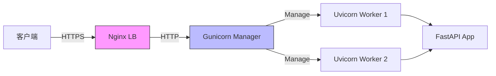

# FastAPI 教程 - 19. 部署指南

> **适合人群**：DevOps, 后端开发者
> **前置知识**：Docker 基础（可选）
> **预计时间**：20 分钟

## 🚀 Uvicorn vs Gunicorn

*   **Uvicorn**: 一个高性能的 ASGI 服务器。它负责解析 HTTP 请求并将其传递给 FastAPI。
*   **Gunicorn**: 一个成熟的 WSGI 进程管理器。它不直接支持 ASGI，但可以管理 Uvicorn 工作进程。

### 简单部署 (Uvicorn)

对于简单的负载或容器环境，直接使用 Uvicorn 即可：

```bash
# host=0.0.0.0 允许外部访问
uvicorn main:app --host 0.0.0.0 --port 80
```

### 生产级部署 (Gunicorn + Uvicorn)

为了利用多核 CPU，我们通常使用 Gunicorn 来管理多个 Uvicorn 进程 (Workers)。

```bash
uv add "uvicorn[standard]" gunicorn
```

启动命令：

```bash
# -w 4 表示启动 4 个 worker 进程
# -k uvicorn.workers.UvicornWorker 指定使用 Uvicorn
gunicorn main:app -w 4 -k uvicorn.workers.UvicornWorker -b 0.0.0.0:80
```

## 🐳 Docker 部署 (推荐)

容器化是目前最流行的部署方式。

### 1. 编写 Dockerfile

```dockerfile
# 使用官方轻量级 Python 镜像
FROM python:3.10-slim

# 设置工作目录
WORKDIR /app

# 复制依赖文件 (利用 Docker 缓存层)
COPY pyproject.toml uv.lock ./

# 安装 UV 并安装依赖
RUN pip install uv && \
    uv sync --frozen --no-install-project

# 复制项目代码
COPY . .

# 暴露端口
EXPOSE 8000

# 启动命令 (使用 UV 运行)
CMD ["uv", "run", "uvicorn", "main:app", "--host", "0.0.0.0", "--port", "8000"]
```

### 2. 构建与运行

```bash
# 构建镜像
docker build -t my-fastapi-app .

# 运行容器
docker run -d -p 8000:8000 my-fastapi-app
```

## 🔒 HTTPS (TLS)

FastAPI 自身不处理 HTTPS。在生产环境中，通常在 FastAPI 前面架设一个反向代理（如 **Nginx** 或 **Traefik**）来处理 HTTPS 加密和证书管理。

**架构示例**：

客户端 (HTTPS) -> Nginx (解密) -> (HTTP) -> Uvicorn/FastAPI

### 生产环境架构图



## 📚 总结

*   开发环境用 `fastapi dev`。
*   生产环境推荐 Docker 部署。
*   使用 `Gunicorn` 管理多进程以利用多核 CPU。
*   使用 Nginx 等反向代理处理 HTTPS。

下一章，我们将讨论大型项目的**目录结构**最佳实践。
