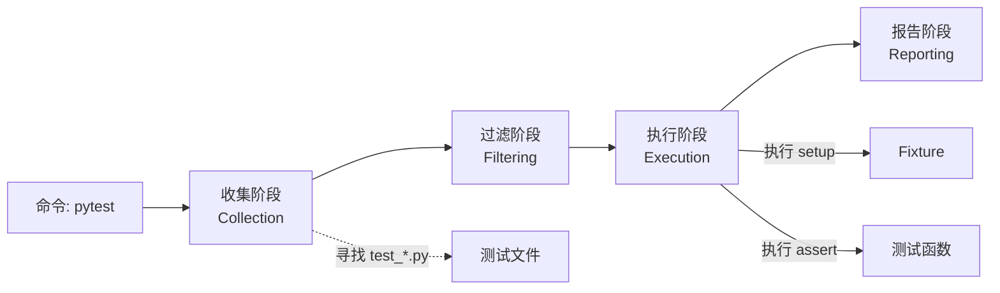

# Pytest 教程 - 01. 简介与安装

> **适合人群**：Python 开发者
> **前置知识**：Python 基础
> **预计时间**：15 分钟

## 🧪 为什么选择 Pytest？

**Pytest** 是 Python 生态中最流行、最强大的测试框架。
*   **简单**：无需样板代码，直接写函数即可测试。
*   **强大**：丰富的插件生态（`pytest-django`, `pytest-asyncio` 等）。
*   **智能**：详细的错误报告，无需复杂的 `assertEqual`。

### 运行机制



## 🛠️ 安装 Pytest

我们推荐使用 **UV** 进行安装，速度极快。

```bash
# 添加为开发依赖
uv add --dev pytest
```

或者使用 pip（配合清华源）：

```bash
pip install pytest -i https://pypi.tuna.tsinghua.edu.cn/simple
```

验证安装：

```bash
pytest --version
```

## 🚀 编写第一个测试

创建一个文件 `test_sample.py`：

```python
def func(x):
    return x + 1

def test_answer():
    assert func(3) == 5
```

运行测试：

```bash
pytest
```

你将看到红色的 `FAILED` 提示，这正是 Pytest 的强大之处——它会告诉你具体的失败原因：

```
E       assert 4 == 5
E        +  where 4 = func(3)
```

## 📚 总结

*   Pytest 是开箱即用的测试框架。
*   测试文件通常以 `test_` 开头。
*   使用简单的 `assert` 语句即可进行断言。

下一章，我们将深入了解 **断言与报告**。
