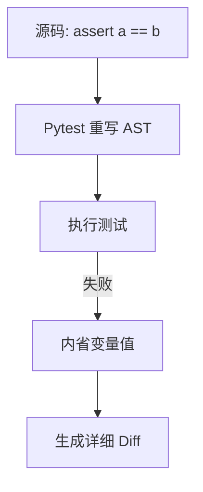

# Pytest 教程 - 02. 编写与断言

> **适合人群**：Python 开发者
> **前置知识**：Pytest 安装
> **预计时间**：15 分钟

## 🔍 强大的 Assert

与 `unittest` 不同，Pytest 不需要 `self.assertEqual`。你只需要使用 Python 原生的 `assert` 关键字。

Pytest 使用 **Assertion Rewriting** 技术，能够通过内省（Introspection）提供极其详细的失败信息。

### 断言内省机制



## 📝 常见断言模式

```python
def test_assertions():
    # 相等
    assert 1 + 1 == 2
    
    # 包含
    assert 1 in [1, 2, 3]
    
    # 字符串包含
    assert "test" in "this is a test"
    
    # 比较
    assert 5 > 3
```

## 💥 测试异常

有些时候，我们需要测试代码**是否抛出了预期的异常**。使用 `pytest.raises` 上下文管理器：

```python
import pytest

def test_recursion_depth():
    with pytest.raises(ZeroDivisionError):
        1 / 0

def test_exception_message():
    # 还可以匹配异常信息
    with pytest.raises(ValueError, match="must be 0 or None"):
        raise ValueError("value must be 0 or None")
```

如果代码块**没有**抛出指定的异常，测试将失败。

## 📚 总结

*   直接使用 `assert`，简单且强大。
*   使用 `pytest.raises` 测试异常情况。
*   Pytest 会自动展示列表、字典等复杂结构的详细 Diff。

下一章，我们将学习 Pytest 的核心功能：**Fixture**。
