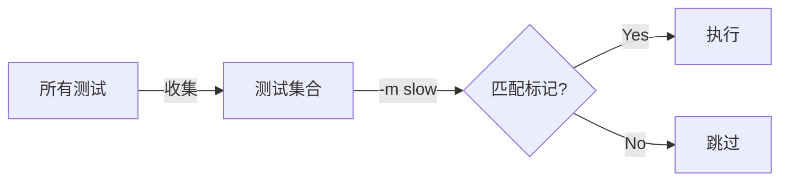

# Pytest 教程 - 05. 标记与配置

> **适合人群**：进阶开发者
> **前置知识**：命令行基础
> **预计时间**：15 分钟

## 🏷️ 使用 Mark 标记

Pytest 允许你给测试函数打标签，以便按需运行或特殊处理。

```python
import pytest

@pytest.mark.slow
def test_heavy_computation():
    # 模拟耗时操作
    pass

@pytest.mark.web
def test_api_call():
    pass
```

运行指定标记的测试：

```bash
pytest -m slow
pytest -m "not slow"
```

### 筛选流程



## ⏭️ 跳过与预期失败

*   **Skip**: 直接跳过不执行。
    ```python
    @pytest.mark.skip(reason="功能未完成")
    def test_feature_x(): ...
    
    @pytest.mark.skipif(sys.platform == "win32", reason="不在 Windows 运行")
    def test_linux_only(): ...
    ```

*   **Xfail**: 预期会失败（如果它通过了，反而是 XPASS）。
    ```python
    @pytest.mark.xfail
    def test_bug_123():
        # 已知的 Bug，等待修复
        assert 1 == 2
    ```

## ⚙️ 配置文件 pytest.ini

为了避免每次都输入长命令，我们可以使用 `pytest.ini` 配置文件。

```ini
[pytest]
# 默认命令行参数
addopts = -v --html=report.html

# 注册自定义标记，防止警告
markers =
    slow: 标记耗时测试
    web: 标记 Web 集成测试

# 指定测试目录
testpaths = tests
```

## 📚 总结

*   使用 `-m` 运行特定标记的测试。
*   `skip` 和 `xfail` 处理特殊情况。
*   `pytest.ini` 用于持久化配置。

下一章，我们将结合 **FastAPI** 进行实战测试。
