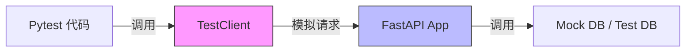

# Pytest 教程 - 06. 实战：测试 FastAPI

> **适合人群**：Web 开发者
> **前置知识**：FastAPI, Pytest
> **预计时间**：20 分钟

## 🔌 集成架构

测试 Web API 时，我们通常使用 `TestClient`，它可以直接调用 FastAPI 应用而无需启动真实的 HTTP 服务器。



## 📝 编写测试代码

安装依赖：
```bash
uv add httpx
```

假设 `main.py`：
```python
from fastapi import FastAPI

app = FastAPI()

@app.get("/")
async def read_main():
    return {"msg": "Hello World"}
```

测试文件 `tests/test_main.py`：

```python
from fastapi.testclient import TestClient
from main import app

client = TestClient(app)

def test_read_main():
    response = client.get("/")
    assert response.status_code == 200
    assert response.json() == {"msg": "Hello World"}
```

## 🧩 覆盖依赖 (Dependency Overrides)

在测试中，我们通常不希望连接真实的生产数据库。FastAPI 提供了 `dependency_overrides` 来替换依赖。

```python
from main import app, get_db
from typing import Generator

# 模拟数据库会话
def override_get_db() -> Generator:
    try:
        db = MockSession()
        yield db
    finally:
        pass

# 应用覆盖
app.dependency_overrides[get_db] = override_get_db

def test_create_user():
    # 这里的请求将使用 MockSession
    response = client.post("/users/", json={"name": "Test"})
    assert response.status_code == 200
```

## 📊 生成覆盖率报告

安装 `pytest-cov`：

```bash
uv add --dev pytest-cov
```

运行并生成 HTML 报告：

```bash
pytest --cov=app --cov-report=html
```

打开 `htmlcov/index.html` 即可查看详细的代码覆盖率。

## 📚 总结

*   `TestClient` 基于 `httpx`，速度快且易用。
*   使用 `dependency_overrides` 隔离外部依赖（数据库、Redis 等）。
*   结合 `pytest-cov` 监控测试质量。

🎉 **恭喜！** 你已经掌握了 Pytest 的核心用法。现在，尝试给你的项目加上测试吧！
