# Docker 快速入门教程：容器化技术完全指南

> **适合人群**：开发者、运维人员、希望学习容器化技术的初学者
> **前置知识**：基础的 Linux 命令、了解基本的软件开发概念
> **预计时间**：30-40 分钟完成基础学习
> **系统环境**：基于 Docker 28.3.3 + Ubuntu 22.04 LTS

## 🚀 什么是 Docker？

Docker 是一个开源的容器化平台，它允许开发者将应用程序及其依赖打包到一个轻量级、可移植的容器中，然后可以在任何支持 Docker 的环境中运行。

### 💡 Docker 的核心价值

- **一次构建，到处运行**：消除"在我机器上可以运行"的问题
- **轻量级**：容器比虚拟机更小、启动更快
- **环境一致性**：开发、测试、生产环境完全一致
- **资源高效**：共享操作系统内核，节省系统资源
- **微服务友好**：非常适合构建和部署微服务架构

### 📊 Docker vs 传统虚拟机

| 特性 | Docker 容器 | 传统虚拟机 |
|------|------------|-----------|
| **启动速度** | 🚀 秒级 | 🐢 分钟级 |
| **资源占用** | 📉 MB 级别 | 📈 GB 级别 |
| **性能** | ⚡ 接近原生 | 🔋 有性能损耗 |
| **操作系统** | 共享宿主机内核 | 每个 VM 完整 OS |
| **隔离性** | 进程级别隔离 | 完全隔离 |
| **部署密度** | 单机可运行上千容器 | 单机几十个 VM |
| **磁盘占用** | 轻量级 | 重量级 |

### 🏗️ Docker 架构图

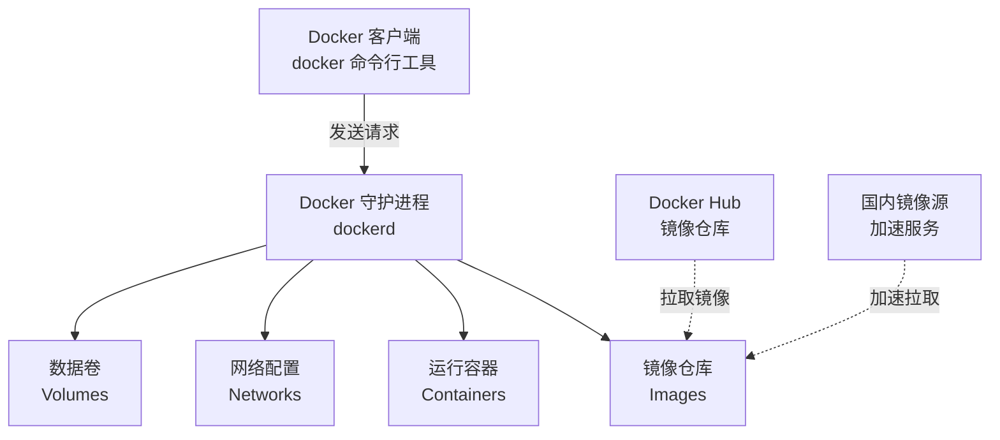

**架构说明**：
- **Docker 客户端**：用户通过 `docker` 命令与 Docker 交互
- **Docker 守护进程**：后台服务，负责管理容器、镜像等
- **镜像 (Images)**：应用的静态模板
- **容器 (Containers)**：镜像的运行实例
- **Docker Hub**：官方镜像仓库，类似 GitHub

## 🛠️ 安装 Docker

### Ubuntu 22.04 安装（推荐方式）

#### 方法一：使用官方脚本（最简单）

```bash
# 下载并执行官方安装脚本
curl -fsSL https://get.docker.com -o get-docker.sh
sudo sh get-docker.sh

# 启动 Docker 服务
sudo systemctl start docker
sudo systemctl enable docker
```

#### 方法二：使用 APT 仓库（更可控）

```bash
# 1. 更新软件包索引
sudo apt-get update

# 2. 安装依赖包
sudo apt-get install -y \
    ca-certificates \
    curl \
    gnupg \
    lsb-release

# 3. 添加 Docker 官方 GPG 密钥
sudo mkdir -p /etc/apt/keyrings
curl -fsSL https://download.docker.com/linux/ubuntu/gpg | \
    sudo gpg --dearmor -o /etc/apt/keyrings/docker.gpg

# 4. 设置稳定版仓库
echo \
  "deb [arch=$(dpkg --print-architecture) signed-by=/etc/apt/keyrings/docker.gpg] \
  https://download.docker.com/linux/ubuntu \
  $(lsb_release -cs) stable" | \
  sudo tee /etc/apt/sources.list.d/docker.list > /dev/null

# 5. 安装 Docker Engine
sudo apt-get update
sudo apt-get install -y docker-ce docker-ce-cli containerd.io \
    docker-buildx-plugin docker-compose-plugin

# 6. 启动 Docker 服务
sudo systemctl start docker
sudo systemctl enable docker
```

### 其他 Linux 发行版

#### CentOS / RHEL

```bash
# 安装依赖
sudo yum install -y yum-utils

# 添加 Docker 仓库
sudo yum-config-manager --add-repo \
    https://download.docker.com/linux/centos/docker-ce.repo

# 安装 Docker
sudo yum install -y docker-ce docker-ce-cli containerd.io

# 启动服务
sudo systemctl start docker
sudo systemctl enable docker
```

### macOS 安装

1. 下载 [Docker Desktop for Mac](https://www.docker.com/products/docker-desktop)
2. 双击 `.dmg` 文件安装
3. 启动 Docker Desktop 应用
4. 等待状态栏图标显示 Docker 正在运行

### Windows 安装

1. 确保启用 WSL 2（Windows 10/11）
2. 下载 [Docker Desktop for Windows](https://www.docker.com/products/docker-desktop)
3. 运行安装程序
4. 重启计算机
5. 启动 Docker Desktop

### 验证安装

```bash
# 查看 Docker 版本
docker --version
# 输出示例：Docker version 28.3.3, build 980b856

# 查看详细信息
docker info

# 运行测试容器
docker run hello-world
```

### 配置非 root 用户使用 Docker（重要）

```bash
# 将当前用户添加到 docker 组
sudo usermod -aG docker $USER

# 重新登录或执行以下命令使组权限生效
newgrp docker

# 测试是否可以无 sudo 运行
docker run hello-world
```

## 🌐 配置国内镜像源（重点章节）

### ⚠️ 为什么需要配置镜像源？

Docker 官方镜像仓库 Docker Hub 位于国外，国内访问速度慢甚至无法访问。配置国内镜像源可以：
- ✅ 大幅提升镜像拉取速度（从几小时到几分钟）
- ✅ 避免网络超时和连接失败
- ✅ 节省带宽和时间成本

### 🚀 配置步骤（基于系统实际配置）

#### 1. 创建或编辑 Docker 配置文件

```bash
# 创建配置目录（如果不存在）
sudo mkdir -p /etc/docker

# 编辑配置文件
sudo vim /etc/docker/daemon.json
```

#### 2. 添加镜像源配置

将以下内容添加到 `/etc/docker/daemon.json`：

```json
{
  "registry-mirrors": [
    "http://hub-mirror.c.163.com",
    "https://docker.m.daocloud.io"
  ]
}
```

**推荐的国内镜像源列表**：

| 镜像源 | 地址 | 特点 |
|--------|------|------|
| **网易** | `http://hub-mirror.c.163.com` | 稳定可靠 ⭐ |
| **DaoCloud** | `https://docker.m.daocloud.io` | 速度快 ⭐ |
| **阿里云** | `https://[你的ID].mirror.aliyuncs.com` | 需要注册获取 |
| **腾讯云** | `https://mirror.ccs.tencentyun.com` | 腾讯用户推荐 |
| **华为云** | `https://05f073ad3c0010ea0f4bc00b7105ec20.mirror.swr.myhuaweicloud.com` | 华为用户推荐 |
| **中科大** | `https://docker.mirrors.ustc.edu.cn` | 教育网友好 |

💡 **小贴士**：可以同时配置多个镜像源，Docker 会按顺序尝试。

#### 3. 重启 Docker 服务

```bash
# 重新加载配置
sudo systemctl daemon-reload

# 重启 Docker 服务
sudo systemctl restart docker
```

#### 4. 验证配置是否生效

```bash
# 查看镜像源配置
docker info | grep -A 5 "Registry Mirrors"

# 输出示例：
# Registry Mirrors:
#  http://hub-mirror.c.163.com/
#  https://docker.m.daocloud.io/
```

### 📊 镜像拉取流程图

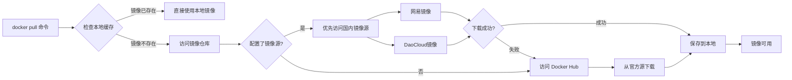

### 🧪 测试镜像拉取速度

```bash
# 拉取一个较大的镜像测试速度
time docker pull python:3.10

# 对比配置前后的速度差异
```

## 📚 核心概念详解

### 4.1 镜像 (Image)

#### 什么是镜像？

镜像是一个**只读的模板**，包含运行应用所需的一切：
- 代码和程序
- 运行时环境（Python、Node.js 等）
- 系统工具和库
- 配置文件

可以把镜像理解为：
- **类**（面向对象编程）→ 镜像
- **安装包**（软件安装）→ 镜像
- **模具**（制造业）→ 镜像

#### 镜像分层结构

Docker 镜像采用**分层存储**架构，每一层只记录与上一层的差异：

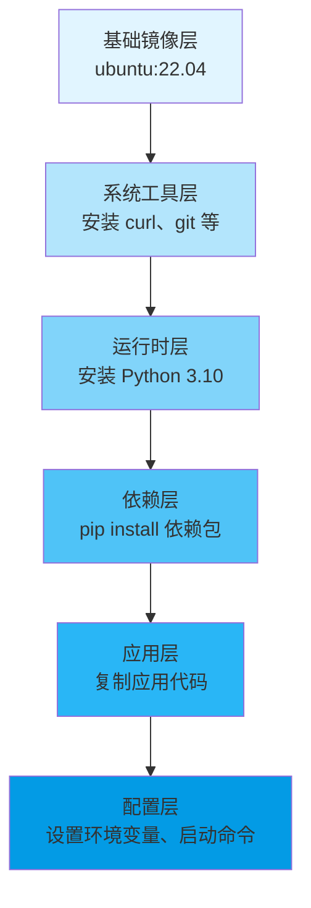

**分层的好处**：
- ✅ **节省存储空间**：相同的层可以被多个镜像共享
- ✅ **加速构建**：未修改的层可以使用缓存
- ✅ **快速部署**：只需下载修改的层

#### 常用镜像命令

```bash
# 搜索镜像
docker search nginx

# 拉取镜像
docker pull nginx:latest

# 查看本地镜像
docker images

# 查看镜像详细信息
docker inspect nginx:latest

# 删除镜像
docker rmi nginx:latest

# 构建镜像
docker build -t myapp:v1.0 .

# 给镜像打标签
docker tag myapp:v1.0 myapp:latest

# 导出镜像
docker save -o nginx.tar nginx:latest

# 导入镜像
docker load -i nginx.tar
```

### 4.2 容器 (Container)

#### 什么是容器？

容器是镜像的**运行实例**，是一个独立运行的应用进程。

**镜像 vs 容器**：
- **镜像**：静态的文件集合（类比：程序文件）
- **容器**：动态的运行环境（类比：正在运行的进程）

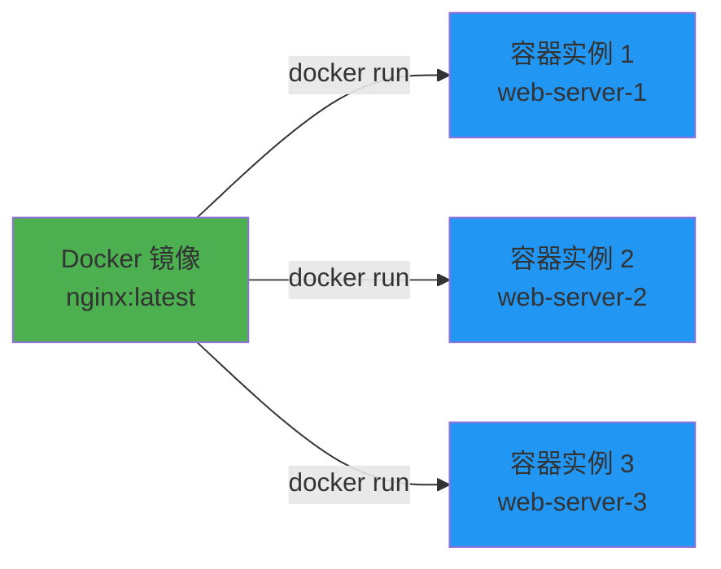

#### 容器生命周期

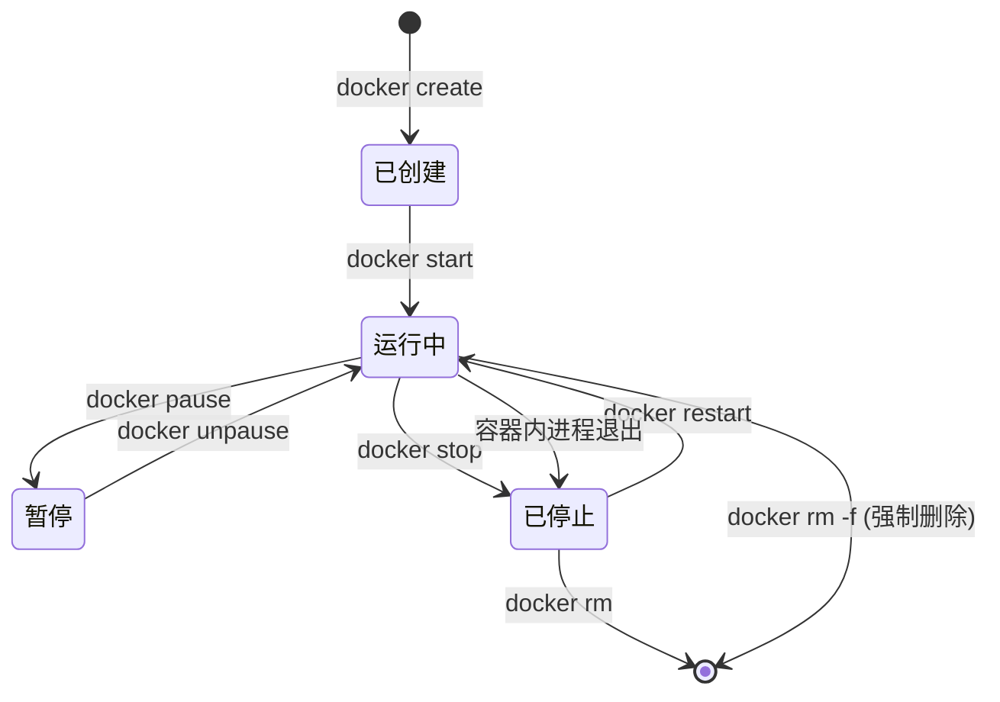

#### 常用容器命令

```bash
# 运行容器（创建并启动）
docker run -d --name mynginx -p 8080:80 nginx

# 查看运行中的容器
docker ps

# 查看所有容器（包括停止的）
docker ps -a

# 启动容器
docker start mynginx

# 停止容器
docker stop mynginx

# 重启容器
docker restart mynginx

# 暂停容器
docker pause mynginx

# 恢复容器
docker unpause mynginx

# 删除容器
docker rm mynginx

# 强制删除运行中的容器
docker rm -f mynginx

# 进入容器内部
docker exec -it mynginx bash

# 查看容器日志
docker logs -f mynginx

# 查看容器资源使用情况
docker stats mynginx

# 查看容器详细信息
docker inspect mynginx
```

### 4.3 Dockerfile

#### 什么是 Dockerfile？

Dockerfile 是一个**文本文件**，包含构建 Docker 镜像的所有指令。通过 Dockerfile，可以自动化、可重复地构建镜像。

#### Dockerfile 构建流程

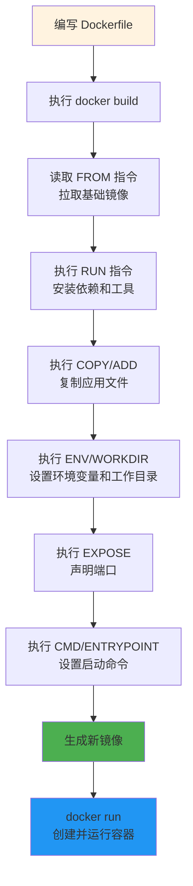

#### Dockerfile 常用指令

| 指令 | 说明 | 示例 |
|------|------|------|
| `FROM` | 指定基础镜像 | `FROM python:3.10-slim` |
| `WORKDIR` | 设置工作目录 | `WORKDIR /app` |
| `COPY` | 复制文件到镜像 | `COPY . /app` |
| `ADD` | 复制文件（支持 URL 和自动解压） | `ADD app.tar.gz /app` |
| `RUN` | 执行命令（构建时） | `RUN pip install -r requirements.txt` |
| `CMD` | 容器启动命令（可被覆盖） | `CMD ["python", "app.py"]` |
| `ENTRYPOINT` | 容器启动入口（不可覆盖） | `ENTRYPOINT ["python"]` |
| `ENV` | 设置环境变量 | `ENV PORT=8000` |
| `EXPOSE` | 声明端口 | `EXPOSE 8000` |
| `VOLUME` | 定义数据卷挂载点 | `VOLUME /data` |
| `USER` | 指定运行用户 | `USER nobody` |
| `ARG` | 构建参数 | `ARG VERSION=1.0` |

#### Dockerfile 示例

```dockerfile
# 使用官方 Python 运行时作为基础镜像
FROM python:3.10-slim

# 设置工作目录
WORKDIR /app

# 复制依赖文件
COPY requirements.txt .

# 安装依赖（使用国内源加速）
RUN pip install --no-cache-dir -r requirements.txt \
    -i https://pypi.tuna.tsinghua.edu.cn/simple/

# 复制应用代码
COPY . .

# 设置环境变量
ENV PYTHONUNBUFFERED=1 \
    PORT=8000

# 暴露端口
EXPOSE 8000

# 创建非 root 用户
RUN useradd -m -u 1000 appuser && \
    chown -R appuser:appuser /app

# 切换到非 root 用户
USER appuser

# 启动命令
CMD ["python", "app.py"]
```

### 4.4 Docker Compose

#### 什么是 Docker Compose？

Docker Compose 是一个**多容器编排工具**，用于定义和运行多容器 Docker 应用。通过一个 YAML 文件配置所有服务。

**适用场景**：
- Web 应用 + 数据库
- 微服务架构
- 开发环境快速搭建
- CI/CD 测试环境

#### 多容器应用架构

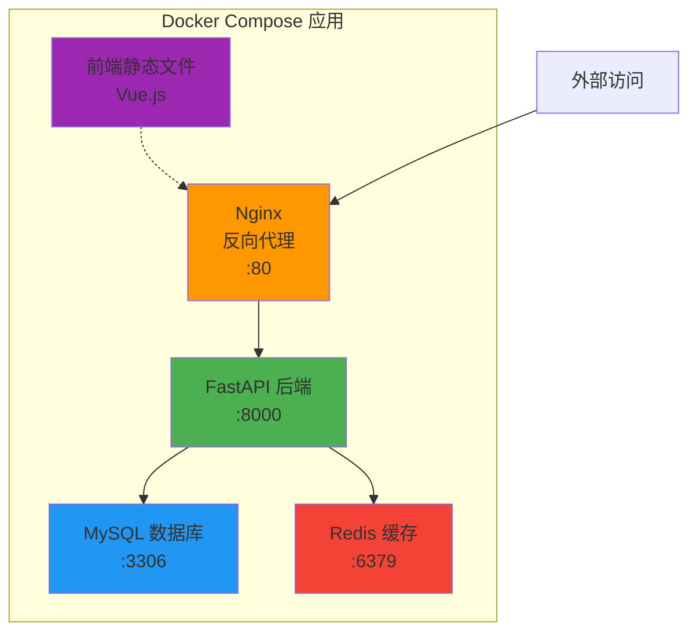

#### docker-compose.yml 示例

```yaml
version: '3.8'

services:
  # Web 服务
  web:
    build: .
    ports:
      - "8000:8000"
    environment:
      - DATABASE_URL=mysql://root:password@db:3306/myapp
      - REDIS_URL=redis://cache:6379
    depends_on:
      - db
      - cache
    volumes:
      - ./app:/app
    networks:
      - app-network

  # 数据库服务
  db:
    image: mysql:5.7
    environment:
      MYSQL_ROOT_PASSWORD: password
      MYSQL_DATABASE: myapp
    volumes:
      - db-data:/var/lib/mysql
    networks:
      - app-network

  # 缓存服务
  cache:
    image: redis:7-alpine
    networks:
      - app-network

volumes:
  db-data:

networks:
  app-network:
    driver: bridge
```

#### Docker Compose 常用命令

```bash
# 启动所有服务
docker compose up

# 后台启动
docker compose up -d

# 停止服务
docker compose stop

# 停止并删除容器
docker compose down

# 查看服务状态
docker compose ps

# 查看服务日志
docker compose logs -f

# 重启服务
docker compose restart

# 构建镜像
docker compose build

# 进入服务容器
docker compose exec web bash
```

## 🎯 快速上手实战

### 运行第一个容器：Hello World

```bash
# 运行官方的 hello-world 镜像
docker run hello-world

# Docker 会自动：
# 1. 检查本地是否有 hello-world 镜像
# 2. 如果没有，从配置的镜像源下载
# 3. 创建并运行容器
# 4. 容器输出欢迎信息后自动退出
```

### 运行一个 Nginx Web 服务器

```bash
# 运行 Nginx 容器，映射端口到本地 8080
docker run -d --name my-nginx -p 8080:80 nginx

# 参数说明：
# -d: 后台运行
# --name: 指定容器名称
# -p 8080:80: 将容器的 80 端口映射到主机的 8080 端口

# 访问 http://localhost:8080 查看效果

# 查看容器日志
docker logs my-nginx

# 停止容器
docker stop my-nginx

# 删除容器
docker rm my-nginx
```

### 常用命令速查表

#### 镜像管理

| 命令 | 说明 | 示例 |
|------|------|------|
| `docker pull` | 拉取镜像 | `docker pull nginx:latest` |
| `docker images` | 列出镜像 | `docker images` |
| `docker rmi` | 删除镜像 | `docker rmi nginx:latest` |
| `docker build` | 构建镜像 | `docker build -t myapp:v1 .` |
| `docker tag` | 标记镜像 | `docker tag myapp:v1 myapp:latest` |
| `docker search` | 搜索镜像 | `docker search python` |
| `docker history` | 查看镜像历史 | `docker history nginx` |

#### 容器管理

| 命令 | 说明 | 示例 |
|------|------|------|
| `docker run` | 创建并运行容器 | `docker run -d -p 80:80 nginx` |
| `docker ps` | 列出运行中的容器 | `docker ps` |
| `docker ps -a` | 列出所有容器 | `docker ps -a` |
| `docker start` | 启动容器 | `docker start mynginx` |
| `docker stop` | 停止容器 | `docker stop mynginx` |
| `docker restart` | 重启容器 | `docker restart mynginx` |
| `docker rm` | 删除容器 | `docker rm mynginx` |
| `docker exec` | 进入容器执行命令 | `docker exec -it mynginx bash` |
| `docker logs` | 查看容器日志 | `docker logs -f mynginx` |
| `docker inspect` | 查看容器详情 | `docker inspect mynginx` |

#### 系统管理

| 命令 | 说明 | 示例 |
|------|------|------|
| `docker info` | 显示系统信息 | `docker info` |
| `docker version` | 显示版本信息 | `docker version` |
| `docker stats` | 显示资源使用情况 | `docker stats` |
| `docker system df` | 显示磁盘使用 | `docker system df` |
| `docker system prune` | 清理未使用的资源 | `docker system prune -a` |

## 💻 实战案例一：Python 应用容器化

### 创建简单的 Flask 应用

**1. 项目结构**

```
flask-demo/
├── app.py
├── requirements.txt
└── Dockerfile
```

**2. app.py**

```python
from flask import Flask, jsonify
import os

app = Flask(__name__)

@app.route('/')
def home():
    return jsonify({
        "message": "Hello from Docker!",
        "version": "1.0",
        "hostname": os.environ.get('HOSTNAME', 'unknown')
    })

@app.route('/health')
def health():
    return jsonify({"status": "healthy"})

if __name__ == '__main__':
    port = int(os.environ.get('PORT', 5000))
    app.run(host='0.0.0.0', port=port)
```

**3. requirements.txt**

```
flask==3.0.0
```

**4. Dockerfile**

```dockerfile
# 使用官方 Python 镜像
FROM python:3.10-slim

# 设置工作目录
WORKDIR /app

# 复制依赖文件
COPY requirements.txt .

# 安装依赖（使用清华源）
RUN pip install --no-cache-dir -r requirements.txt \
    -i https://pypi.tuna.tsinghua.edu.cn/simple/

# 复制应用代码
COPY app.py .

# 设置环境变量
ENV PORT=5000

# 暴露端口
EXPOSE 5000

# 启动命令
CMD ["python", "app.py"]
```

**5. 构建和运行**

```bash
# 构建镜像
docker build -t flask-demo:v1.0 .

# 运行容器
docker run -d --name flask-app -p 5000:5000 flask-demo:v1.0

# 测试应用
curl http://localhost:5000

# 查看日志
docker logs -f flask-app
```

### 应用容器化流程

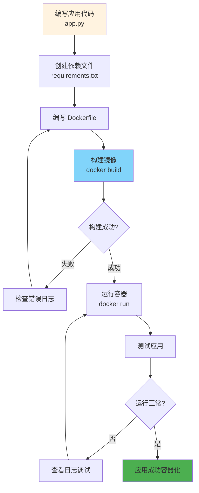

## 🚀 实战案例二：UV + FastAPI 项目容器化

结合本项目的 UV Python 包管理器，创建一个 FastAPI 应用的完整容器化方案。

### 项目结构

```
fastapi-uv-demo/
├── app/
│   ├── __init__.py
│   └── main.py
├── pyproject.toml
├── uv.lock
├── Dockerfile
└── docker-compose.yml
```

### 应用代码

**app/main.py**

```python
from fastapi import FastAPI
from pydantic import BaseModel
import os

app = FastAPI(title="FastAPI with UV Demo")

class Item(BaseModel):
    name: str
    price: float

@app.get("/")
def read_root():
    return {
        "message": "FastAPI + UV + Docker",
        "environment": os.environ.get("ENV", "development")
    }

@app.get("/health")
def health_check():
    return {"status": "healthy"}

@app.post("/items/")
def create_item(item: Item):
    return {"item": item, "status": "created"}
```

### Dockerfile（使用 UV）

```dockerfile
# 多阶段构建 - 第一阶段：安装依赖
FROM python:3.10-slim AS builder

# 安装 UV（使用清华源加速）
RUN pip install --no-cache-dir uv -i https://pypi.tuna.tsinghua.edu.cn/simple/

# 设置工作目录
WORKDIR /app

# 复制依赖文件
COPY pyproject.toml uv.lock ./

# 使用 UV 安装依赖到虚拟环境
RUN uv sync --frozen

# 多阶段构建 - 第二阶段：运行环境
FROM python:3.10-slim

# 设置工作目录
WORKDIR /app

# 从构建阶段复制虚拟环境
COPY --from=builder /app/.venv /app/.venv

# 复制应用代码
COPY app /app/app

# 设置环境变量
ENV PATH="/app/.venv/bin:$PATH" \
    PYTHONUNBUFFERED=1 \
    ENV=production

# 暴露端口
EXPOSE 8000

# 启动命令
CMD ["fastapi", "run", "app/main.py", "--host", "0.0.0.0", "--port", "8000"]
```

### Docker Compose 配置

**docker-compose.yml**

```yaml
version: '3.8'

services:
  # FastAPI 应用
  api:
    build:
      context: .
      dockerfile: Dockerfile
    container_name: fastapi-uv-api
    ports:
      - "8000:8000"
    environment:
      - ENV=production
      - DATABASE_URL=mysql://root:password@db:3306/fastapi_db
    depends_on:
      - db
    volumes:
      - ./app:/app/app  # 开发时热重载
    networks:
      - app-network
    restart: unless-stopped

  # MySQL 数据库
  db:
    image: mysql:5.7
    container_name: fastapi-mysql
    environment:
      MYSQL_ROOT_PASSWORD: password
      MYSQL_DATABASE: fastapi_db
      MYSQL_USER: fastapi_user
      MYSQL_PASSWORD: fastapi_pass
    ports:
      - "3306:3306"
    volumes:
      - mysql-data:/var/lib/mysql
    networks:
      - app-network
    restart: unless-stopped
    command: --character-set-server=utf8mb4 --collation-server=utf8mb4_unicode_ci

volumes:
  mysql-data:
    driver: local

networks:
  app-network:
    driver: bridge
```

### FastAPI + MySQL 架构图

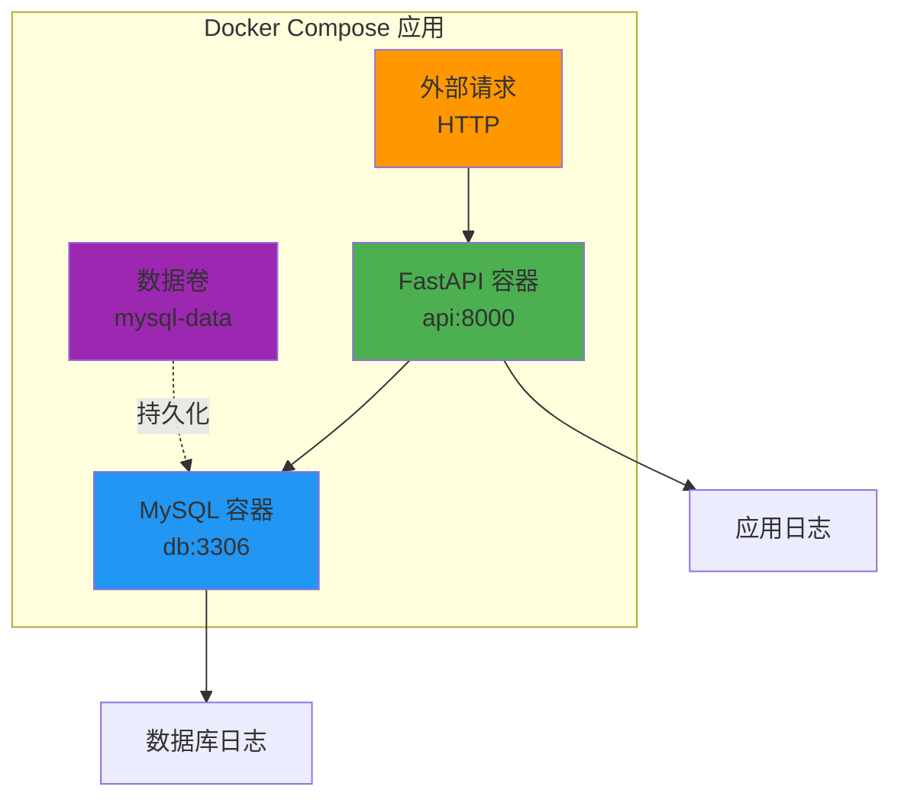

### 运行步骤

```bash
# 1. 启动所有服务
docker compose up -d

# 2. 查看服务状态
docker compose ps

# 3. 查看日志
docker compose logs -f api

# 4. 测试 API
curl http://localhost:8000
curl http://localhost:8000/health
curl -X POST http://localhost:8000/items/ \
  -H "Content-Type: application/json" \
  -d '{"name": "测试商品", "price": 99.99}'

# 5. 进入容器调试
docker compose exec api bash

# 6. 停止服务
docker compose down

# 7. 停止并删除数据卷
docker compose down -v
```

## 🔧 Docker Compose 详解

### Compose 服务依赖关系

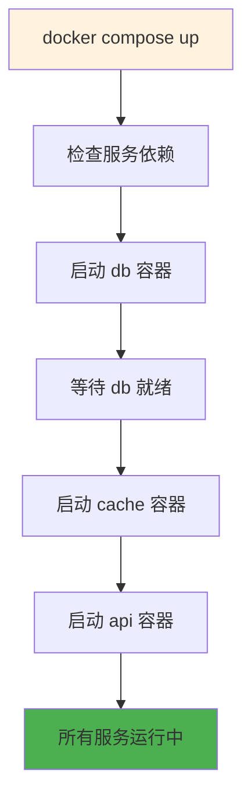

### 常用配置选项

```yaml
version: '3.8'

services:
  web:
    # 构建配置
    build:
      context: .
      dockerfile: Dockerfile
      args:
        - VERSION=1.0
    
    # 镜像名称
    image: myapp:latest
    
    # 容器名称
    container_name: web-app
    
    # 端口映射
    ports:
      - "8000:8000"
      - "8443:443"
    
    # 环境变量
    environment:
      - DEBUG=false
      - DATABASE_URL=postgres://user:pass@db/mydb
    
    # 环境变量文件
    env_file:
      - .env
    
    # 数据卷挂载
    volumes:
      - ./app:/app
      - static-data:/app/static
    
    # 网络配置
    networks:
      - frontend
      - backend
    
    # 依赖服务
    depends_on:
      - db
      - cache
    
    # 重启策略
    restart: unless-stopped
    
    # 健康检查
    healthcheck:
      test: ["CMD", "curl", "-f", "http://localhost:8000/health"]
      interval: 30s
      timeout: 10s
      retries: 3
    
    # 资源限制
    deploy:
      resources:
        limits:
          cpus: '0.5'
          memory: 512M
```

## ❓ 常见问题与解决方案

### 问题排查决策树

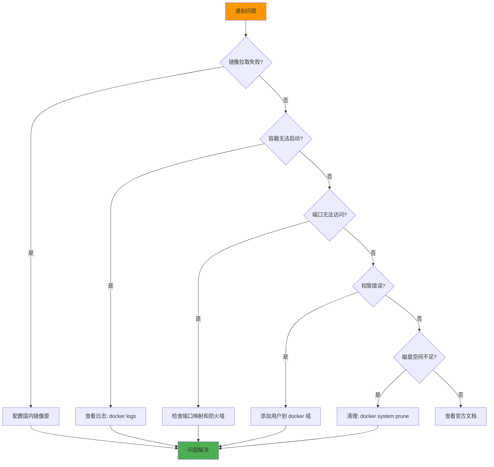

### 1. 镜像拉取失败

**问题**：`error pulling image: Get https://registry-1.docker.io/v2/: dial tcp: lookup registry-1.docker.io: no such host`

**解决方案**：

```bash
# 配置国内镜像源（参考前面章节）
sudo vim /etc/docker/daemon.json

# 添加镜像源配置后重启
sudo systemctl restart docker

# 验证配置
docker info | grep -A 5 "Registry Mirrors"
```

### 2. 权限问题

**问题**：`Got permission denied while trying to connect to the Docker daemon socket`

**解决方案**：

```bash
# 将用户添加到 docker 组
sudo usermod -aG docker $USER

# 重新登录或刷新组权限
newgrp docker

# 验证
docker ps
```

### 3. 端口已被占用

**问题**：`Bind for 0.0.0.0:8080 failed: port is already allocated`

**解决方案**：

```bash
# 查看端口占用
sudo lsof -i :8080
sudo netstat -tulpn | grep 8080

# 停止占用端口的容器
docker ps | grep 8080
docker stop <container_id>

# 或使用其他端口
docker run -p 8081:80 nginx
```

### 4. 容器无法连接网络

**问题**：容器内无法访问外网

**解决方案**：

```bash
# 检查 Docker 网络
docker network ls
docker network inspect bridge

# 重启 Docker 服务
sudo systemctl restart docker

# 检查防火墙设置
sudo ufw status
```

### 5. 磁盘空间不足

**问题**：`no space left on device`

**解决方案**：

```bash
# 查看磁盘使用
docker system df

# 清理未使用的镜像
docker image prune -a

# 清理停止的容器
docker container prune

# 清理未使用的数据卷
docker volume prune

# 全面清理（谨慎使用）
docker system prune -a --volumes
```

### 6. 容器内时区问题

**解决方案**：

```dockerfile
# 在 Dockerfile 中设置时区
ENV TZ=Asia/Shanghai
RUN ln -snf /usr/share/zoneinfo/$TZ /etc/localtime && \
    echo $TZ > /etc/timezone
```

### 7. 中文乱码问题

**解决方案**：

```dockerfile
# 在 Dockerfile 中设置编码
ENV LANG=C.UTF-8 \
    LC_ALL=C.UTF-8
```

## 🎓 最佳实践

### 1. Dockerfile 优化技巧

#### ✅ 使用多阶段构建减小镜像体积

```dockerfile
# 构建阶段
FROM node:18 AS builder
WORKDIR /app
COPY package*.json ./
RUN npm install
COPY . .
RUN npm run build

# 生产阶段
FROM nginx:alpine
COPY --from=builder /app/dist /usr/share/nginx/html
EXPOSE 80
CMD ["nginx", "-g", "daemon off;"]
```

#### ✅ 合并 RUN 指令减少层数

```dockerfile
# ❌ 不好：创建多层
RUN apt-get update
RUN apt-get install -y curl
RUN apt-get install -y git

# ✅ 好：合并为一层
RUN apt-get update && \
    apt-get install -y curl git && \
    rm -rf /var/lib/apt/lists/*
```

#### ✅ 利用构建缓存

```dockerfile
# 先复制依赖文件，再复制代码
# 这样代码改动不会导致重新安装依赖
COPY requirements.txt .
RUN pip install -r requirements.txt
COPY . .
```

#### ✅ 使用 .dockerignore

```
# .dockerignore 文件
.git
.gitignore
node_modules
__pycache__
*.pyc
.env
.vscode
README.md
```

### 2. 安全建议

```dockerfile
# ✅ 使用非 root 用户运行
RUN useradd -m -u 1000 appuser
USER appuser

# ✅ 使用官方镜像
FROM python:3.10-slim

# ✅ 固定版本标签，避免使用 latest
FROM nginx:1.25.3-alpine

# ✅ 扫描漏洞
# docker scan myapp:latest
```

### 3. 生产环境部署

```bash
# 使用健康检查
docker run -d \
  --name myapp \
  --health-cmd="curl -f http://localhost:8000/health || exit 1" \
  --health-interval=30s \
  --health-timeout=10s \
  --health-retries=3 \
  myapp:latest

# 设置资源限制
docker run -d \
  --name myapp \
  --cpus="0.5" \
  --memory="512m" \
  myapp:latest

# 设置重启策略
docker run -d \
  --name myapp \
  --restart=unless-stopped \
  myapp:latest
```

### 4. 日志管理

```bash
# 限制日志大小
docker run -d \
  --name myapp \
  --log-driver=json-file \
  --log-opt max-size=10m \
  --log-opt max-file=3 \
  myapp:latest
```

## 📖 进阶资源

### 官方文档

- [Docker 官方文档](https://docs.docker.com/)
- [Docker Hub](https://hub.docker.com/)
- [Dockerfile 参考](https://docs.docker.com/engine/reference/builder/)
- [Docker Compose 文档](https://docs.docker.com/compose/)

### 推荐教程

- [Docker 从入门到实践](https://yeasy.gitbook.io/docker_practice/)
- [Docker 中文社区](https://www.docker.org.cn/)

### 镜像仓库

- **Docker Hub**：https://hub.docker.com/
- **网易镜像中心**：https://c.163yun.com/hub
- **阿里云容器镜像服务**：https://cr.console.aliyun.com/

### 相关项目

- **本项目 UV 教程**：[UV 快速入门](../uv/getting-started.md)
- **FastAPI 项目示例**：[examples/fastapi-demo](../../../examples/fastapi-demo/)

## 🎉 总结

恭喜你完成 Docker 快速入门教程！现在你已经掌握：

✅ Docker 的核心概念和架构
✅ 在 Ubuntu 22.04 上安装和配置 Docker
✅ 配置国内镜像源加速镜像拉取
✅ 镜像和容器的管理
✅ 编写 Dockerfile 构建自定义镜像
✅ 使用 Docker Compose 编排多容器应用
✅ Python/FastAPI 应用的容器化实战
✅ 常见问题的排查和解决
✅ 生产环境的最佳实践

### 下一步建议

1. **实践项目**：将自己的项目容器化
2. **学习编排**：了解 Kubernetes（K8s）
3. **CI/CD 集成**：将 Docker 集成到 CI/CD 流程
4. **性能优化**：学习镜像优化和容器监控
5. **安全加固**：学习 Docker 安全最佳实践

---

> 💡 **提示**：Docker 是一门实践性很强的技术，建议多动手操作，遇到问题查看官方文档和社区资源。

> 📝 **反馈**：如果你对本教程有任何建议或发现错误，欢迎提交 Issue 或 Pull Request！
